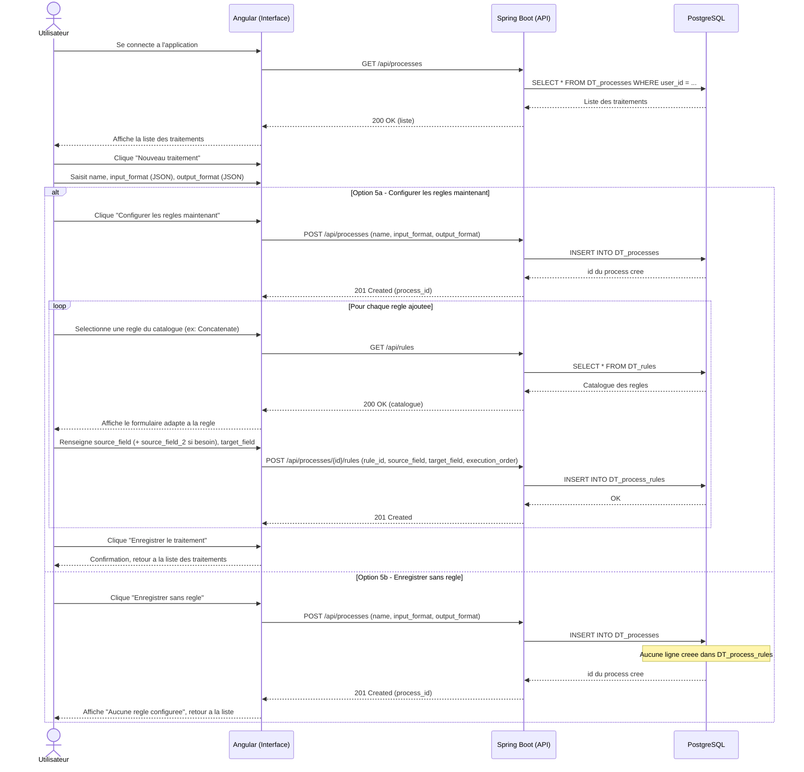

# Diagramme de séquence — Scénario A : Création et configuration d'un traitement

```mermaid
sequenceDiagram
  actor U as Utilisateur
  participant A as Angular (Interface)
  participant S as Spring Boot (API)
  participant D as PostgreSQL

  U->>A: Se connecte a l'application
  A->>S: GET /api/processes
  S->>D: SELECT * FROM DT_processes WHERE user_id = ...
  D-->>S: Liste des traitements
  S-->>A: 200 OK (liste)
  A-->>U: Affiche la liste des traitements

  U->>A: Clique "Nouveau traitement"
  U->>A: Saisit name, input_format (JSON), output_format (JSON)

  alt Option 5a - Configurer les regles maintenant
    U->>A: Clique "Configurer les regles maintenant"
    A->>S: POST /api/processes (name, input_format, output_format)
    S->>D: INSERT INTO DT_processes
    D-->>S: id du process cree
    S-->>A: 201 Created (process_id)

    loop Pour chaque regle ajoutee
      U->>A: Selectionne une regle du catalogue (ex: Concatenate)
      A->>S: GET /api/rules
      S->>D: SELECT * FROM DT_rules
      D-->>S: Catalogue des regles
      S-->>A: 200 OK (catalogue)
      A-->>U: Affiche le formulaire adapte a la regle
      U->>A: Renseigne source_field (+ source_field_2 si besoin), target_field
      A->>S: POST /api/processes/{id}/rules (rule_id, source_field, target_field, execution_order)
      S->>D: INSERT INTO DT_process_rules
      D-->>S: OK
      S-->>A: 201 Created
    end

    U->>A: Clique "Enregistrer le traitement"
    A-->>U: Confirmation, retour a la liste des traitements

  else Option 5b - Enregistrer sans regle
    U->>A: Clique "Enregistrer sans regle"
    A->>S: POST /api/processes (name, input_format, output_format)
    S->>D: INSERT INTO DT_processes
    Note over D: Aucune ligne creee dans DT_process_rules
    D-->>S: id du process cree
    S-->>A: 201 Created (process_id)
    A-->>U: Affiche "Aucune regle configuree", retour a la liste
  end
```
